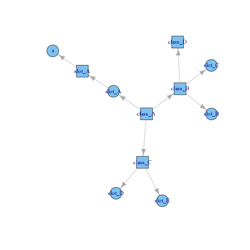

# packagestructure

Create a graph of the structure of an `R` package.

May be useful in reducing the cognitive load when writing `R` packages with any
more than a few S4 classes.

*Currently only supports S4 classes and slots*. See *TODO* list below.

## Installation

```
devtools::install_github("rmflight/packagestructure")
```

## Examples

### A Source Package on Your Local Machine


```r
library(packagestructure)
example_package <- system.file("exampledata", package = "packagestructure")
e_g <- class_graph(example_package)
plot(e_g)
```

 

In this example, classes *class_B*, *class_C* directly inherit from *class_A*,
while *class_D* inherits from *class_B*. Each of these has particular slots
of particular classes. You can see the set of class definitions [here](https://github.com/rmflight/packagestructure/blob/master/inst/exampledata/R/s4_slotandclass.R).

### An Installed Package

```
# not run
library(Matrix)
m_g <- class_graph("package:Matrix")
plot(m_g)
```

## History

Another package, `classGraph` is available on Cran, and was created by Martin Maechler
based on code originally done by Robert Gentleman. However, that package uses `Bioconductor`'s
`graph` package (which does not handle graph unions nicely), and `Rgraphviz`, which
can be a pain to install on Windows machines, and does not handle slots and their
relationships.

Therefore I used some of the relevant code from Martin's package (licensed
as GPL, which is why this package is GPL-2 and why he is listed as an author),
converted it to use `igraph`, and did some of my own thing.

## TODO

* improve test coverage (classunion and no-classes)
* add travis-ci and coveralls
* allow specification of classes to show and classes to exclude
* add *methods*?
* add *function call* dependency?
